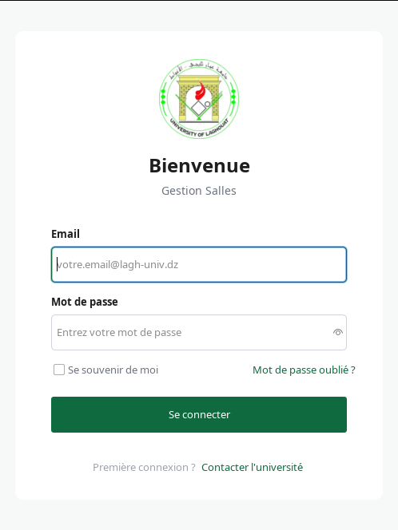
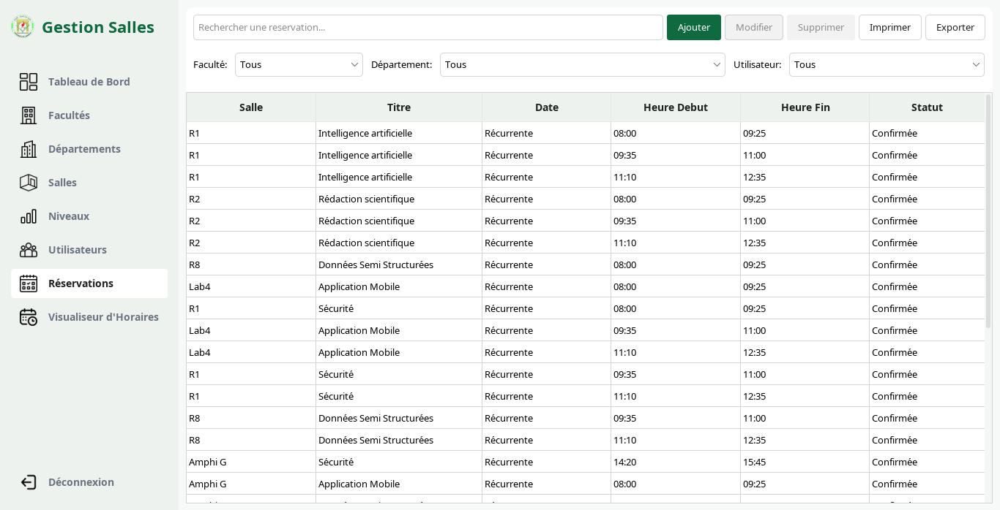
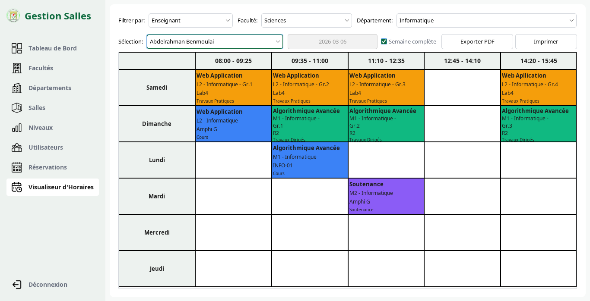

# GestionSalles

GestionSalles is a Java desktop project focused on organizing university room management through role-based workflows and reservation control.

## Project Overview

The application models the internal operations of an academic institution where:

- administrators supervise global configuration and monitoring,
- department heads manage local planning and reservations,
- teachers consult schedules and assigned room usage.

It includes business logic for reservation conflict detection, authentication/session checks, and structured data access for academic entities (departments, blocs, levels, rooms, users, and reservations).

## Main Functional Areas

- Role-based dashboards and navigation
- Reservation lifecycle and timetable visualization
- Conflict detection for overlapping room allocations
- Academic structure management (department, bloc, level, room)
- User/account flows including password recovery and session validation
- Audit/security-oriented service layer behavior

## Technical Context

- Language: Java
- Build system: Maven
- Database model: MySQL schema + SQL migration/seed scripts
- UI: Swing desktop application
- Layering: `views`, `services`, `dao`, `models`, `utils`

## Repository Structure

- `src/main/java/com/gestion/salles`: application source code
- `src/main/resources`: non-code resources and configuration templates
- `src/test/java/com/gestion/salles`: tests
- `db/`: SQL schema, migration, and seed scripts
- `docs/`: project documentation

## Documentation References

- `docs/database.md`
- `docs/security-and-session.md`
- `docs/packaging.md`
- `APP_FULL_REFERENCE.md`

## Screenshots

## Copyright and Usage

Copyright (c) 2026 Abdelrahman Benmoulai.
All rights reserved.

This repository is published for presentation/documentation purposes.
No permission is granted to copy, modify, redistribute, or use this code in other projects without explicit written authorization from the author.
